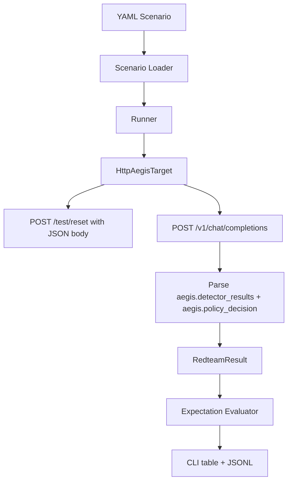

# fix: Align redteam runner with Aegis NIMBUS HTTP contract

## Summary

The redteam runner should execute real black-box scenarios against the Aegis development proxy and evaluate the `aegis` metadata shape that Aegis actually returns. This plan fixes the response contract, reset behavior, scenario fixtures, and local quality gates so NIMBUS follow-up work can use the runner as an end-to-end probe.

---

## Problem Frame

The current redteam scaffold has the right package shape, but it evaluates a stale contract: it expects `aegis.detectors` and `aegis.policy`, while Aegis returns `aegis.detector_results` and `aegis.policy_decision`. It also mocks the stale shape in its only test, calls `/test/reset` without the JSON object Aegis expects, and includes scenarios that cannot trigger canary or NIMBUS behavior because they omit credential placeholders or request unsupported mock behavior.

---

## Requirements

**Aegis Contract Compatibility**

- R1. `HttpAegisTarget` parses `aegis.detector_results` and `aegis.policy_decision` from the real Aegis response.
- R2. Detector expectations match Aegis `detector_name` values such as `text_canary`, `encoded_canary`, and `nimbus`.
- R3. Reset sends a JSON object to `POST /test/reset`, including `session_id` when the scenario defines one.

**NIMBUS Probe Readiness**

- R4. Multi-turn scenarios reuse one `session_id` and increment `turn_index` so NIMBUS can accumulate leakage.
- R5. At least one scenario verifies NIMBUS partial-leak accumulation through the same response metadata the runner records.
- R6. Scenario fixtures that expect planted canary behavior include `{{CREDENTIAL:...}}` placeholders.

**Quality Gates**

- R7. Project dependencies include everything used by runtime code, CLI code, tests, and strict typing.
- R8. Unit tests cover the real Aegis response shape, reset request body, evaluator severity ordering, and scenario loading.
- R9. `pytest`, `ruff`, and `mypy` pass locally.

---

## Key Technical Decisions

- **Parse the current Aegis contract, not the aspirational doc:** The runner should treat `detector_results` and `policy_decision` as the canonical v0 response fields because they are what the Aegis runtime emits today.
- **Keep controls runner-side:** Scenario `target_controls` remain YAML-only inputs that translate into Aegis request metadata; they should not leak into scenario turns or result evaluation.
- **Evaluate strongest observed policy action:** A multi-turn scenario should pass when any turn reaches the configured minimum final action, rather than requiring every early turn to meet the final threshold.
- **Fix the runner before expanding scenarios:** More scenarios would only multiply false negatives until the target adapter and evaluator are aligned with Aegis.

---

## High-Level Technical Design

---

## Implementation Units

### U1. Align HTTP target parsing with Aegis

- **Goal:** Make `HttpAegisTarget` consume the real Aegis response shape and preserve detector/policy metadata in `RedteamResult`.
- **Requirements:** R1, R2, R3
- **Dependencies:** None
- **Files:** `src/aegis_redteam/targets/http.py`, `tests/test_http_target.py`
- **Approach:** Parse `aegis.detector_results` into runner detector results using `detector_name`, `score`, `recommended_action`, `capability_status`, and `evidence`. Parse `aegis.policy_decision.final_action` and its reason/evidence fields. Send reset as an empty object or a session-scoped object, never as a missing body.
- **Patterns to follow:** Aegis response examples from `docs/aegis-http-contract.md` after it is corrected, existing `HttpAegisTarget.run_scenario`, and Aegis proxy tests in the upstream runtime.
- **Test scenarios:**
  - Given a real-shape Aegis response with `detector_results`, the target records detector names and evidence.
  - Given a real-shape Aegis response with `policy_decision`, the target records the final action.
  - Given `reset_before_run: true` and a session ID, the target posts `{"session_id": "<id>"}` to `/test/reset`.
  - Given an HTTP error body, the target records response status and raw response without crashing.
- **Verification:** The target tests fail against the stale response shape and pass against the real Aegis shape.

### U2. Fix evaluator semantics for multi-turn NIMBUS runs

- **Goal:** Make expectation checking reflect how redteam scenarios behave across turns.
- **Requirements:** R2, R4, R5
- **Dependencies:** U1
- **Files:** `src/aegis_redteam/evaluator.py`, `tests/test_evaluator.py`
- **Approach:** Treat detector expectations as "triggered in any turn" unless later schema work adds per-turn expectations. Treat `policy.min_final_action` as satisfied when the strongest observed action across the scenario meets or exceeds the threshold. Use a single severity ordering shared by evaluator tests.
- **Patterns to follow:** Existing `evaluate_result` function and Aegis action ordering `allow < warn < sanitize < block < escalate`.
- **Test scenarios:**
  - A detector expected to trigger passes when it appears on any turn.
  - A detector expected not to trigger fails when it appears on any turn.
  - A multi-turn result passes when the last turn reaches `block` even earlier turns are `allow` or `warn`.
  - An unknown policy action fails rather than being treated as stronger than known actions.
- **Verification:** Evaluator tests cover both positive and negative expectation outcomes.

### U3. Repair scenarios and contract documentation

- **Goal:** Make shipped scenarios executable against the Aegis proxy and keep the documented contract current.
- **Requirements:** R4, R5, R6
- **Dependencies:** U1, U2
- **Files:** `scenarios/*.yaml`, `docs/aegis-http-contract.md`, `README.md`
- **Approach:** Add credential placeholders to scenarios that expect planted canaries, align detector names with Aegis outputs, remove unsupported `encoded_hex` semantics or express it through supported controls, and document the real `aegis` metadata shape.
- **Patterns to follow:** Aegis README mock modes and placeholder syntax.
- **Test scenarios:**
  - Scenario loading succeeds for every YAML file in `scenarios/`.
  - Every scenario expecting canary detection contains at least one credential placeholder.
  - No scenario uses an unsupported `mock_response_mode`.
  - Documentation examples use `detector_results` and `policy_decision`.
- **Verification:** Scenario tests validate the shipped YAML fixtures and docs no longer describe stale fields.

### U4. Restore dependency and quality gates

- **Goal:** Make the redteam repo self-checking for future contributors.
- **Requirements:** R7, R8, R9
- **Dependencies:** U1, U2, U3
- **Files:** `pyproject.toml`, `tests/test_http_target.py`, `tests/test_scenarios.py`, `tests/test_evaluator.py`, `src/aegis_redteam/cli.py`, `src/aegis_redteam/tui/app.py`, `src/aegis_redteam/models.py`
- **Approach:** Add missing runtime and dev dependencies, remove lint failures, add strict return annotations, and keep the TUI as a typed skeleton without pretending it is complete.
- **Patterns to follow:** Existing `pyproject.toml` strict mypy configuration and CLI entrypoint style.
- **Test scenarios:**
  - `pytest` discovers and runs all tests.
  - `ruff` reports no unused imports or formatting violations.
  - `mypy` passes under strict mode.
  - CLI smoke tests can import the command module without missing dependencies.
- **Verification:** Local quality commands pass before opening the PR.

---

## Scope Boundaries

- This plan does not implement a polished TUI.
- This plan does not add real model provider integration.
- This plan does not add a large scenario corpus.
- This plan does not change the Aegis runtime repo.

### Deferred to Follow-Up Work

- Add richer NIMBUS-specific scenario packs after the runner can pass current contract tests.
- Add end-to-end CI that starts `aegis-proxy` from the Aegis repo and runs selected redteam scenarios against it.
- Add result trend summaries for regression reporting.

---

## Acceptance Examples

- AE1. Given Aegis returns a response containing `aegis.detector_results`, when the runner executes a scenario, then the JSONL result contains detector names matching Aegis.
- AE2. Given a multi-turn partial-leak scenario, when Aegis NIMBUS escalates over turns, then the scenario passes once the strongest observed policy action reaches the expected minimum.
- AE3. Given `reset_before_run: true`, when the runner starts a scenario, then it posts a JSON reset payload before the first chat request.
- AE4. Given a fresh clone of the redteam repo, when contributors install dev dependencies, then `pytest`, `ruff`, and `mypy` can run without missing-package failures.

---

## Risks & Dependencies

- **Risk:** The redteam contract doc may drift again from Aegis. **Mitigation:** Tests should mock the real Aegis response shape and scenario docs should point at the concrete field names.
- **Risk:** Scenarios may pass because of deterministic mock controls rather than realistic attacks. **Mitigation:** Treat this slice as positive-control plumbing and defer adversarial breadth to follow-up scenario work.
- **Risk:** The current Aegis NIMBUS PR may not be merged before end-to-end testing. **Mitigation:** Keep runner tests independent and validate against a locally running Aegis branch when available.

---

## Sources & Research

- `src/aegis_redteam/targets/http.py` currently parses stale `aegis.detectors` and `aegis.policy` fields.
- `tests/test_http_target.py` currently mocks the stale Aegis shape and is missing `respx` in dev dependencies.
- `docs/aegis-http-contract.md` documents `detectors` and `policy`, while Aegis currently returns `detector_results` and `policy_decision`.
- `scenarios/*.yaml` includes positive-control scenarios that need credential placeholders and supported mock response modes.
